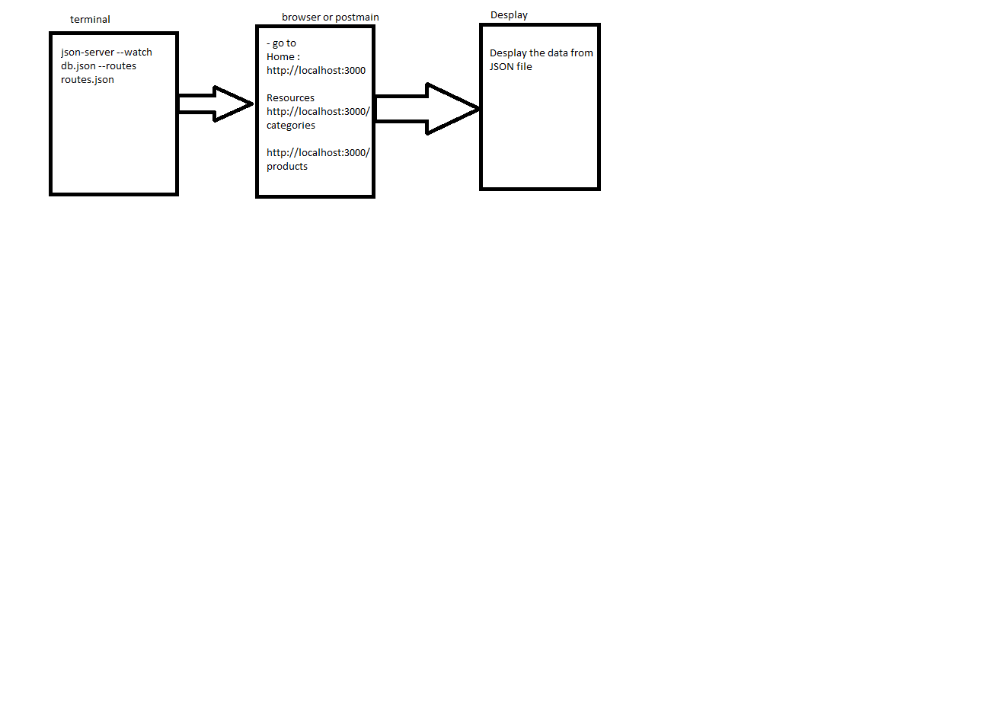

# LAB - Class 4

## Project: lab-06
### Author: Yazan Aljamal

### Links and Resources

- [submission PR](https://github.com/yaljamal-401-advanced-javascript/api-server/pull/2)

### Documentaion
## to run the application the show the data use this comand

> json-server --watch db.json --routes routes.json

## swager link 
> https://app.swaggerhub.com/apis/yaljamal/api-server/0.1
### Setup

- install json-server (npm i json-server)

#### UML

